# Configurando um Controlador de Domínio com Samba no Debian 12 [Em atualização...]
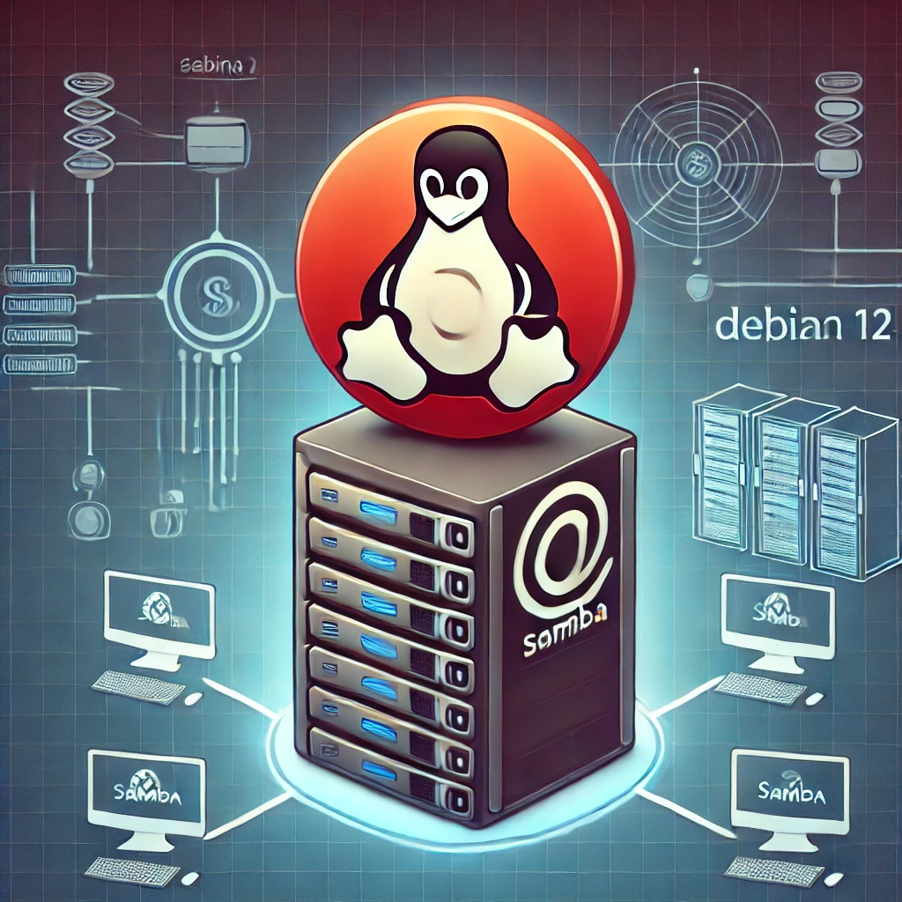

Este guia detalha o processo de configuração de um Controlador de Domínio (DC) utilizando o Samba no Debian 12. O Samba permite a implementação de um Active Directory (AD) compatível com o Windows, fornecendo autenticação centralizada para usuários e dispositivos.

## Requisitos
- Servidor com Debian 12 
- Máquina cliente com Windows 10 
- Acesso root ou privilégios de sudo
- Conectividade de rede estável
- Nome de domínio definido (exemplo: `exemplo.com.br`)
- IP fixo configurado


## 1. Alterar o nome do host
```bash
sudo nano /etc/hostname
```
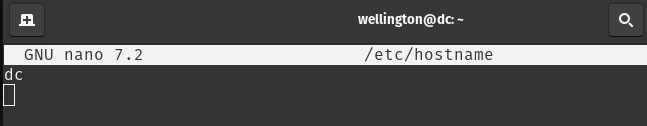  


## 2. Configurar interface de rede
```bash
sudo nano /etc/network/interfaces
```
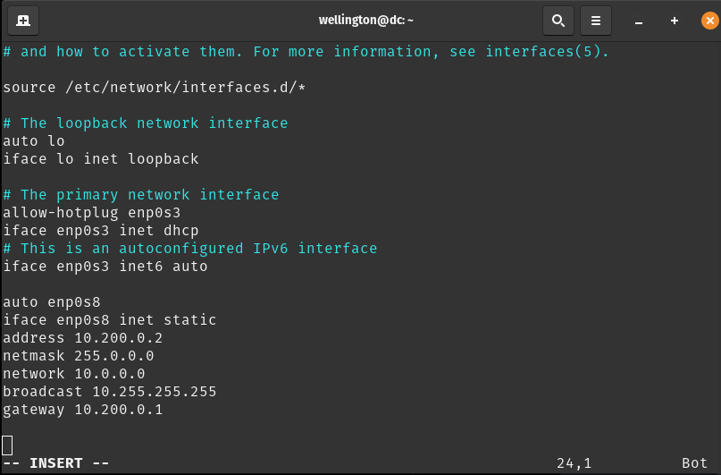  


## 3. Reiniciar o serviço de rede
```bash
sudo systemctl restart networking
ou
sudo systemctl restart systemd-networkd
```
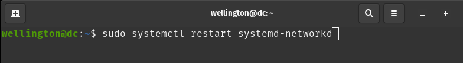 


## 4. Checandar os IPs
```bash
ip -4 a
```


## 5. Atualizar o Sistema
```bash
sudo apt update && sudo apt upgrade -y
```


## 6. Instalar o samba e suas dependências
```sh
sudo apt install samba smbclient winbind libnss-winbind libpam-winbind krb5-user krb5-config acl attr -y
```
Durante a instalação, configure o Kerberos:
- Default Kerberos version 5 realm: `exemplo.com.br`  
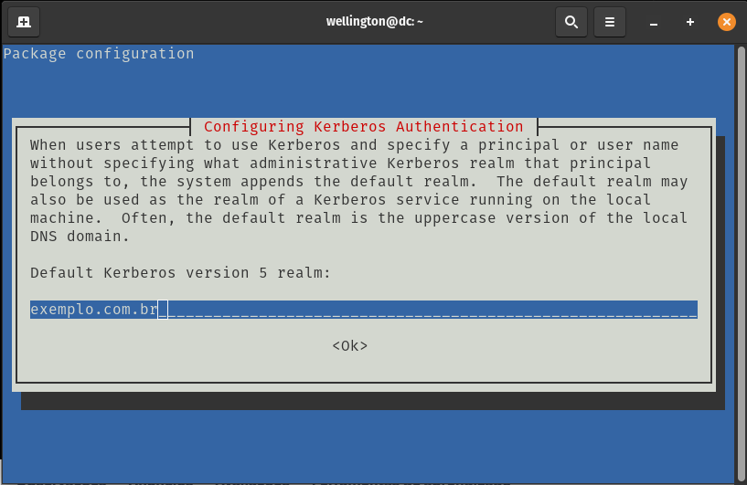
  
- Kerberos servers for your realm: `dc.exemplo.com.br`  


- Administrative server for your Kerberos realm: `dc.exemplo.com.br`  
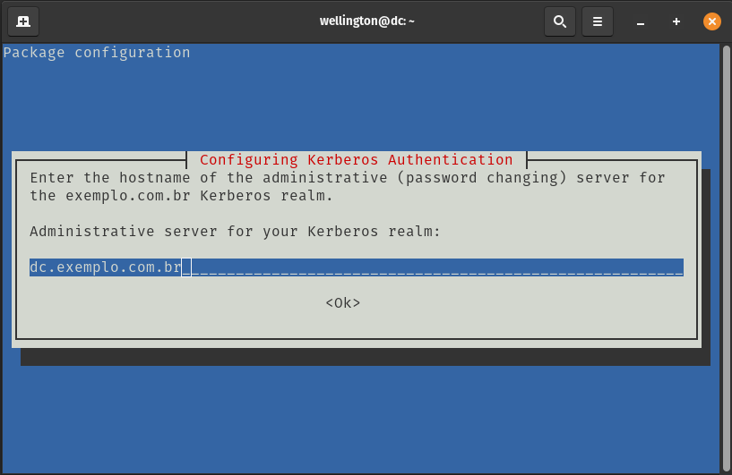  


## 7. Configurar o Samba
Pare os serviços do Samba antes da configuração:
```sh
sudo systemctl stop smbd nmbd winbind
```
Renomeie o arquivo de configuração padrão:
```sh
sudo mv /etc/samba/smb.conf /etc/samba/smb.conf.old
```  
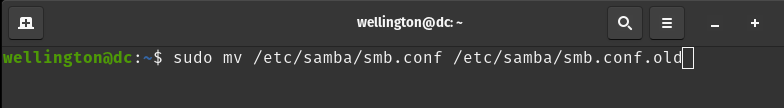

Inicie a configuração do DC:
```sh
sudo samba-tool domain provision --use-rfc2307 --interactive
```
Parâmetros importantes:
- Realm: "exemplo.com.br"
- Domain ["exemplo"]: `<ENTER>`
- Server role...[DC]: `<ENTER>`
- DNS backend...[SAMBA_INTERNAL]: `<ENTER>`
- DNS forwarder...[8.8.8.8]: 10.200.0.2
- Administrator password: `<SENHA-FORTE>`
- Retype password: `<SENHA-FORTE>`


## 8. Checar o conteúdo do smb.conf
```bash
cat /etc/samba/smb.conf
```
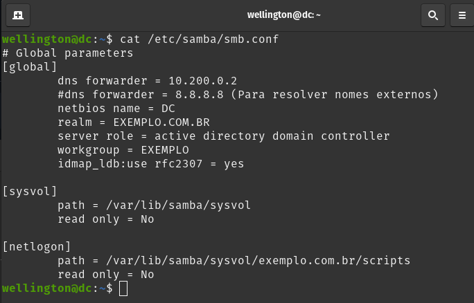  


## 9. Configurar o DNS
Edite:  
```bash
sudo nano /etc/resolv.conf
```
```
nameserver 10.200.0.2
search exemplo.com.br
```
`Observação`: Aqui, talvez seja necessária umas alterações. Dependendo de onde ele receba as informações de DNS.
No atual cenário, está sendo fornecida configuração manual e para não ter o arquivo modificado,
ele será travado: `sudo chattr +i /etc/resolv.conf` Para destravar, basta usar o `-i`.

## 10. Copiar o arquivo krb5.conf
```bash
sudo cp /var/lib/samba/private/krb5.conf /etc
```


## 11. Mudandar o nome do serviço do samba para samba-ad-dc
```bash
sudo systemctl stop smbd nmbd winbind
sudo systemctl disable smbd nmbd winbind
sudo systemctl unmask samba-ad-dc
sudo systemctl start samba-ad-dc
sudo systemctl enable samba-ad-dc
```


## 12. Consultar o status do serviço
```bash
sudo smbclient -L localhost -U%
```
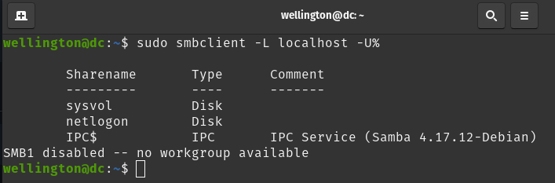 


## 13. Exibir o domínio
```bash
sudo samba-tool domain level show
```
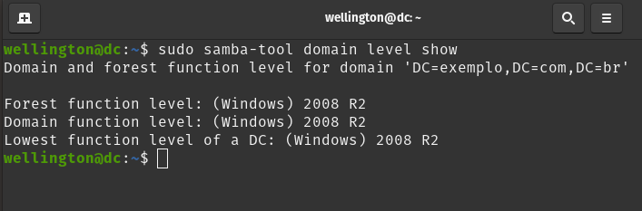 


## 14. Exibir informações do nosso servidor
```bash
sudo samba-tool domain info 10.200.0.2
```
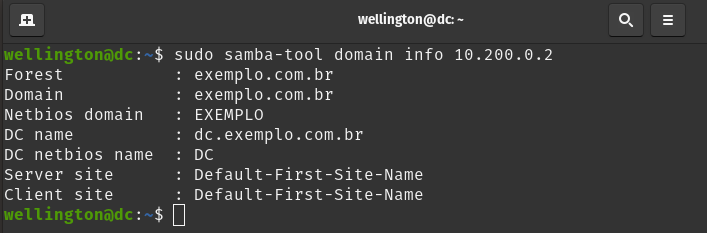 


## 15. Testar a resolução de nomes:
```sh
dig exemplo.com.br
```
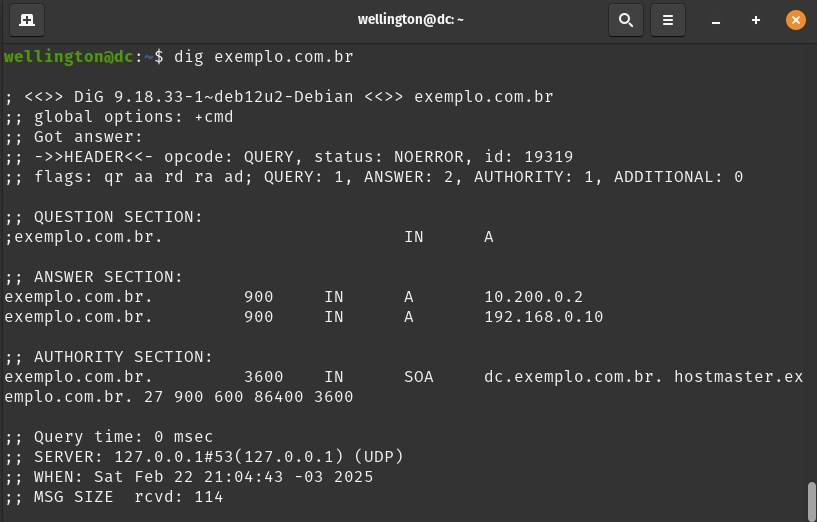 


## 16. Habilitar e Iniciar os Serviços
```sh
sudo systemctl enable samba-ad-dc
sudo systemctl start samba-ad-dc
```
Verifique o status:
```sh
sudo systemctl status samba-ad-dc
```
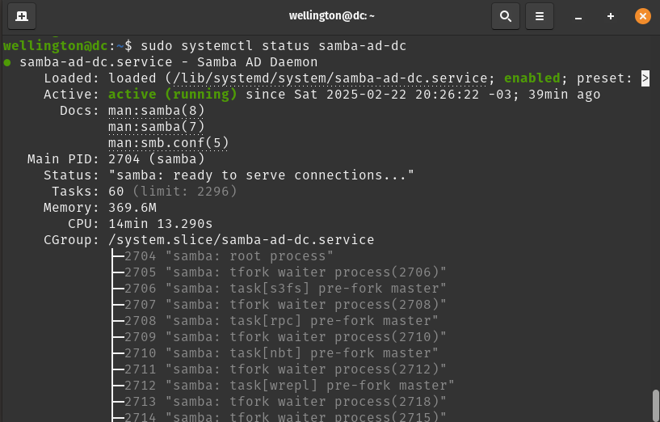 


## 17. Administrar o Domínio usando a ferramenta `samba-tool`:
#### `Observação: Será mostrado o uso mais comum da ferramenta. Para mais exemplos de uso, consultar a documentação.`

### **17.1 Usuários**
- Criar usuários:
  ```bash
  sudo samba-tool user create usuario123 SenhaForte! 
  ```
- Listar usuários:  
  ```bash
  sudo samba-tool user list
  ```
- Desabilitar usuários:
  ```bash
  sudo samba-tool user disable usuario123
  ```
- Habilitar usuários:
  ```bash
  sudo samba-tool user enable usuario123
  ```
- Resetar senha de um usuário:  
  ```bash
  sudo samba-tool user setpassword usuario123 --newpassword=NovaSenha!
  ```
- Definir que o usuário deve alterar a senha no próximo login:  
  ```bash
  sudo samba-tool user setpassword usuario123 --must-change-at-next-login
  ```
- Criar grupos:  
  ```bash
  sudo samba-tool group add TI
  ```
- Adicionar um usuário a um grupo:  
  ```bash
  sudo samba-tool group addmembers TI usuario123
  ```
- Remover um usuário de um grupo:  
  ```bash
  sudo samba-tool group removemembers TI usuario123
  ```
  
### **17.2 Administração de Domínio**
- Criar um novo domínio Samba AD:  
  ```bash
  sudo samba-tool domain provision --realm=EXEMPLO.COM.BR --domain=EXEMPLO --adminpass=SenhaForte! --server-role=dc
  ```
- Adicionar um novo controlador de domínio ao Samba AD:  
  ```bash
  sudo samba-tool domain join EXEMPLO.COM.BR DC -U"Administrador"
  ```
- Rebaixar um controlador de domínio:  
  ```bash
  sudo samba-tool domain demote
  ```
- Listar controladores de domínio ativos:  
  ```bash
  sudo samba-tool domain list
  ```

### **17.3 Gerenciamento de Replicação do AD**
- Forçar replicação entre DCs:  
  ```bash
  sudo samba-tool drs replicate DC1 DC2 dc=exemplo,dc=com
  ```
- Listar status da replicação:  
  ```bash
  sudo samba-tool drs showrepl
  ```
- Verificar a integridade da replicação:  
  ```bash
  sudo samba-tool dbcheck --cross-ncs
  ```

### **17.4 Gerenciamento de DNS**
- Criar um novo registro DNS:  
  ```bash
  sudo samba-tool dns add DC1 exemplo.com.br servidor A 192.168.1.10 -U administrador
  ```
- Listar registros DNS:  
  ```bash
  sudo samba-tool dns query DC1 exemplo.com.br @ ALL -U administrador
  ```
- Remover um registro DNS:  
  ```bash
  sudo samba-tool dns delete DC1 exemplo.com.br servidor A 192.168.1.10 -U administrador
  ```

### **17.5 Gerenciamento de Políticas de Segurança**
- Definir política de senha (exemplo: mínimo de 12 caracteres):  
  ```bash
  sudo samba-tool domain passwordsettings set --min-pwd-length=12
  ```
- Verificar configurações de política de senha:  
  ```bash
  sudo samba-tool domain passwordsettings show
  ```
- Bloquear um usuário:  
  ```bash
  sudo samba-tool user disable usuario123
  ```
- Desbloquear um usuário:  
  ```bash
  sudo samba-tool user enable usuario123
  ```
  
### **17.6 Administração de Group Policy Objects (GPO)**
- Criar uma nova GPO:  
  ```bash
  sudo samba-tool gpo create "Bloqueio de USB" --description="Restringe uso de USB"
  ```
- Listar GPOs disponíveis:  
  ```bash
  sudo samba-tool gpo list
  ```
- Aplicar GPO a uma unidade organizacional (OU):  
  ```bash
  sudo samba-tool gpo set "<GPO_ID>" --apply-on="OU=TI,DC=exemplo,DC=com"
  ```

### **17.7 Gerenciamento de Chaves Kerberos**
- Listar chaves Kerberos no domínio:  
  ```bash
  sudo samba-tool kerberos list
  ```
- Resetar chave da conta de máquina:  
  ```bash
  sudo samba-tool domain passwordsettings set --complexity=off
  ```
- Exibir detalhes do ticket Kerberos:  
  ```bash
  klist -e
  ```

### **17.8 Auditoria e Diagnóstico**
- Verificar integridade da base de dados do AD:  
  ```bash
  sudo samba-tool dbcheck --fix
  ```
- Verificar contas de serviço duplicadas:  
  ```bash
  sudo samba-tool domain tombstones expunge
  ```
- Exibir informações detalhadas de um usuário:  
  ```bash
  sudo samba-tool user show usuario123
  ```

### **17.9 Exportação e Backup**
- Exportar lista de usuários para JSON:  
  ```bash
  sudo samba-tool user list --json > usuarios.json
  ```
- Fazer backup da configuração do domínio:  
  ```bash
  sudo samba-tool domain backup online --targetdir=/backup/samba
  ```
- Restaurar backup:  
  ```bash
  sudo samba-tool domain backup restore --backup-dir=/backup/samba
  ```

### **17.10 Gerenciamento de Compartilhamento de Arquivos**
- Criar um novo compartilhamento:  
  ```bash
  sudo mkdir /srv/compartilhado
  sudo chmod 777 /srv/compartilhado
  ```
  Adicionar ao arquivo `smb.conf`:  
  ```
  [Compartilhado]
  path = /srv/compartilhado
  read only = no
  guest ok = yes
  ```
  Aplicar mudanças:  
  ```bash
  sudo systemctl restart smbd
  ```


## 18. Aqui, alguns scripts para automação:
Aqui estão alguns **scripts de automação** para diferentes tarefas do `samba-tool`, facilitando a administração do Samba AD.  

### **18.1 Script para Criar Usuários em Massa**
Este script lê uma lista de usuários de um arquivo CSV e os cria automaticamente no AD.  

#### - **Arquivo: `usuarios.csv` (Exemplo)**
```
nome,senha,grupo
joao.silva,Senha123!,TI
maria.souza,Senha123!,RH
carlos.ferreira,Senha123!,VENDAS
ana.santos,Senha123!,TI
pedro.almeida,Senha123!,RH
julia.rodrigues,Senha123!,VENDAS
roberto.costa,Senha123!,TI
fernanda.lima,Senha123!,RH
gustavo.mendes,Senha123!,VENDAS
renata.torres,Senha123!,TI
admin.ti,Senha123!,RH
```

#### - **Script: `criar_usuarios.sh`**
#### OBS: Os grupos devem existir.

```bash
#!/bin/bash

INPUT="usuarios.csv"

while IFS=',' read -r nome senha grupo
do
  if [[ "$nome" != "nome" ]]; then
    echo "Criando usuário: $nome..."
    samba-tool user create "$nome" "$senha" --must-change-at-next-login
    samba-tool group addmembers "$grupo" "$nome"
    echo "Usuário $nome criado e adicionado ao grupo $grupo."
  fi
done < "$INPUT"

echo "Processo concluído!"
```

**Como executar:**
```bash
chmod +x criar_usuarios.sh
sudo ./criar_usuarios.sh
```

### **18.2 Script para Resetar Senhas em Massa**
Se precisar redefinir as senhas de vários usuários e obrigá-los a alterá-las no próximo login, use este script.

#### - **Script: `resetar_senhas.sh`**
```bash
#!/bin/bash

USUARIOS=("joao" "maria" "carlos")
NOVA_SENHA="SenhaNova123!"

for usuario in "${USUARIOS[@]}"; do
  echo "Resetando senha do usuário $usuario..."
  samba-tool user setpassword "$usuario" --newpassword="$NOVA_SENHA" --must-change-at-next-login
  echo "Senha de $usuario redefinida."
done

echo "Todas as senhas foram redefinidas."
```

### **18.3 Script para Criar e Aplicar uma GPO**
Cria uma **GPO (Group Policy Object)** e a aplica a uma **Unidade Organizacional (OU)**.

#### - **Script: `criar_gpo.sh`**
```bash
#!/bin/bash

GPO_NOME="Bloqueio_USB"
DESCRICAO="Bloqueia o uso de dispositivos USB"
OU="OU=TI,DC=exemplo,DC=com"

echo "Criando GPO $GPO_NOME..."
GPO_ID=$(samba-tool gpo create "$GPO_NOME" --description="$DESCRICAO" | grep "GUID" | awk '{print $3}')

if [ -n "$GPO_ID" ]; then
  echo "Aplicando GPO $GPO_NOME ($GPO_ID) à OU $OU..."
  samba-tool gpo set "$GPO_ID" --apply-on="$OU"
  echo "GPO aplicada com sucesso!"
else
  echo "Erro ao criar a GPO."
fi
```

### **18.4 Script para Backup e Restauração do Samba**
Este script faz um backup do banco de dados do Samba e permite restaurá-lo quando necessário.

#### - **Script: `backup_samba.sh`**
```bash
#!/bin/bash

BACKUP_DIR="/backup/samba"
DATA=$(date +%F-%H-%M-%S)
ARQUIVO_BACKUP="$BACKUP_DIR/samba-backup-$DATA.tar.gz"

echo "Criando backup do Samba em $ARQUIVO_BACKUP..."
samba-tool domain backup online --targetdir="$BACKUP_DIR"

tar -czvf "$ARQUIVO_BACKUP" "$BACKUP_DIR"
echo "Backup concluído!"

echo "Para restaurar, use: samba-tool domain backup restore --backup-dir=$BACKUP_DIR"
```

**Como executar:**
```bash
chmod +x backup_samba.sh
./backup_samba.sh
```

### **18.5 Script para Monitorar Replicação do AD**
Este script verifica e alerta se há falhas na replicação entre controladores de domínio.

#### - **Script: `monitorar_replicacao.sh`**
```bash
#!/bin/bash

LOG="/var/log/samba-replication.log"

echo "Verificando replicação entre controladores de domínio..."
samba-tool drs showrepl > "$LOG"

if grep -q "error" "$LOG"; then
  echo "Falha detectada na replicação do Samba AD! Verifique o log: $LOG"
else
  echo "Replicação funcionando corretamente."
fi
```

**Como executar:**
```bash
chmod +x monitorar_replicacao.sh
./monitorar_replicacao.sh
```


## 19. Administrar o Domínio usando o `RSAT` (Remote Server Administration Tools):

## 19.1 Instalação:

### 19.1.1 **Via Configurações do Windows**
1. **Abra as Configurações** (`Win + I`).  
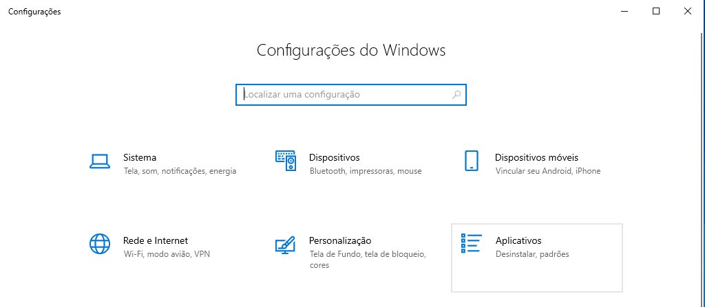 

2. Vá para **"Aplicativos"**, Pesquise por **"Recursos"** e clique em **"Gerenciar recursos opcionais"**.
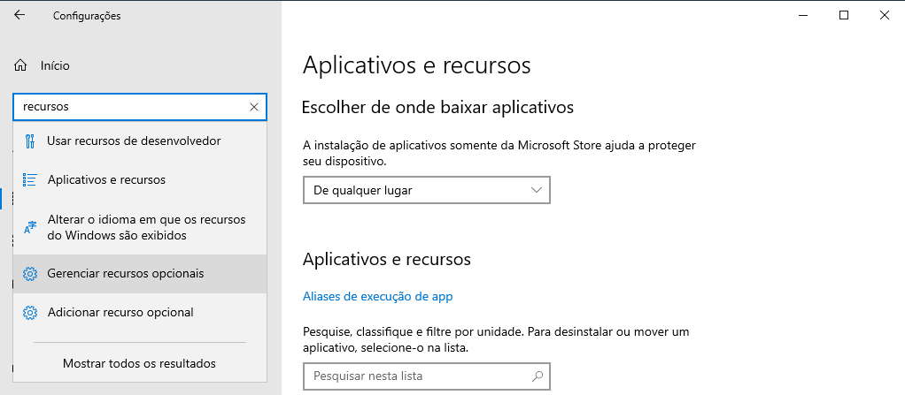 

3. Clique em **"Adicionar um recurso"**.
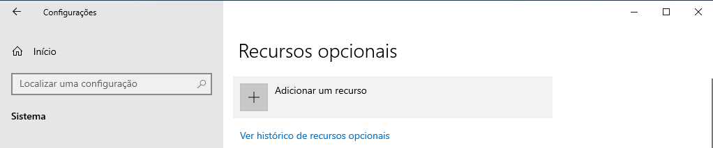 

4. Pesquise por **"RSAT"**: 
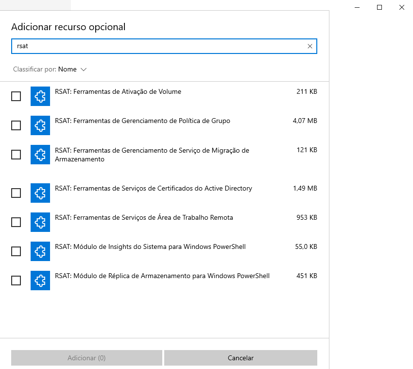 

5. Selecione os módulos desejados, Clique em **"Adicionar"** e aguarde a conclusão.
 

6. Instalados.  
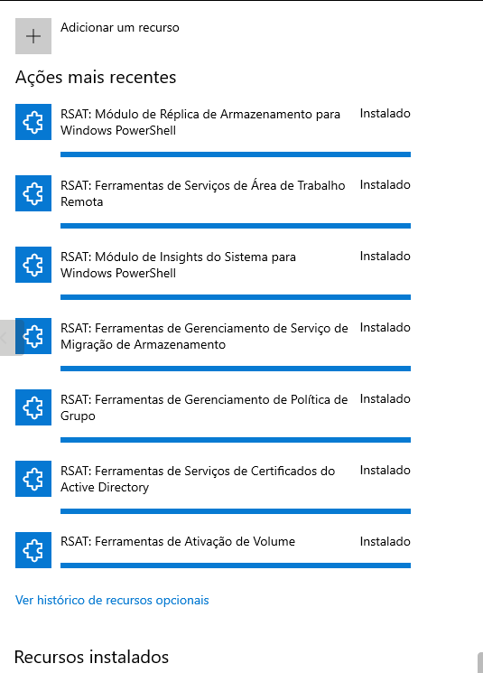  

7. Instalar a ferramenta de administração (Caso não esteja instalada).  
  

### 19.1.2 **Via PowerShell**
Execute o seguinte comando no **PowerShell como Administrador** para listar e instalar os módulos RSAT:

1. **Verificar módulos disponíveis:**
   ```powershell
   Get-WindowsCapability -Online | Where-Object Name -like "RSAT*"
   ```
   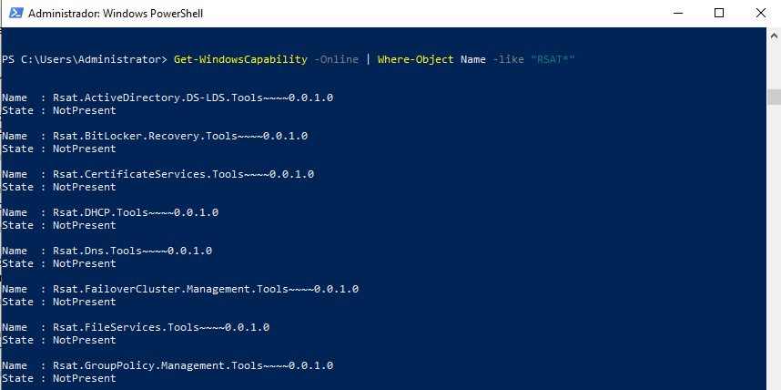  
   
2. **Instalar um módulo específico (exemplo: Active Directory):**
   ```powershell
   Add-WindowsCapability -Online -Name "Rsat.ActiveDirectory.DS-LDS.Tools~~~~0.0.1.0"
   ```

3. **Instalar todos os módulos RSAT de uma vez:**
   ```powershell
   Get-WindowsCapability -Online | Where-Object Name -like "RSAT*" | ForEach-Object { Add-WindowsCapability -Online -Name $_.Name }
   ```
   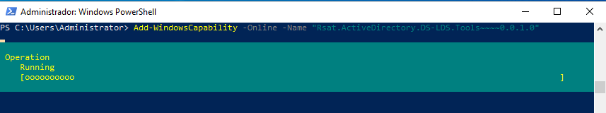 

4. **Confirmar a instalação:**
   ```powershell
   Get-WindowsCapability -Online | Where-Object Name -like "RSAT*" | Select-Object Name, State
   ```
   Se aparecer `Installed`, o recurso foi instalado com sucesso.
   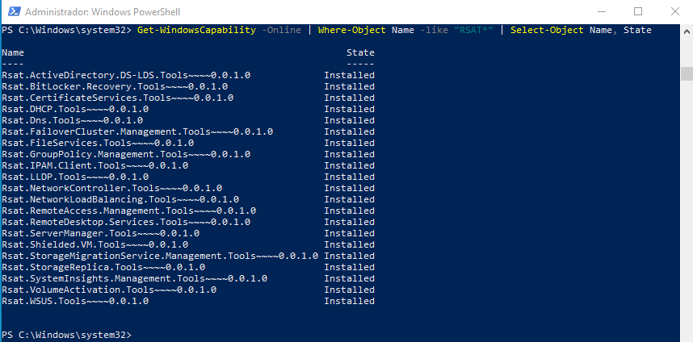


## 20. Conectar ao servidor
20.1 Vá no iniciar e pesquise por **Usuários e Computadores do Active Directory**

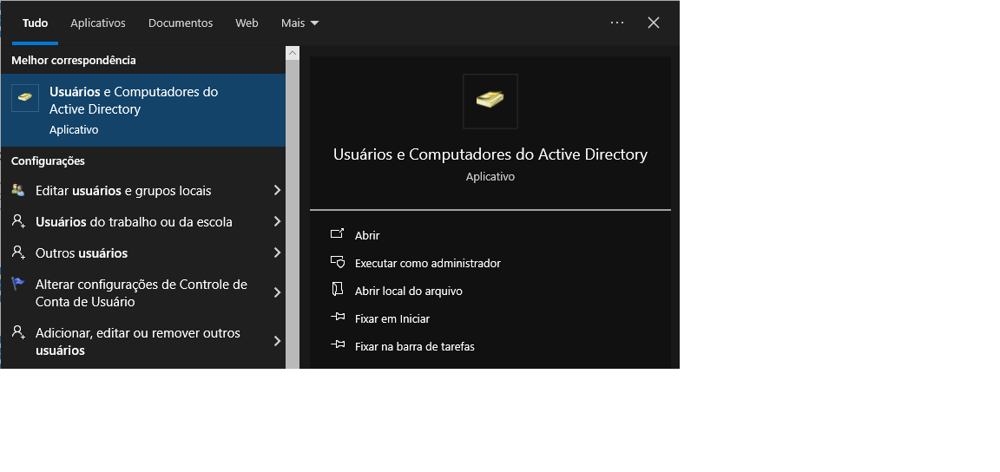
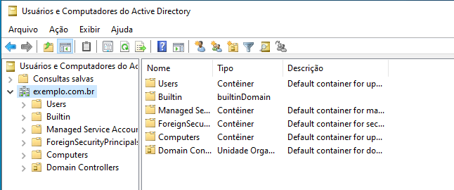  


## 21. Vantagens e desvantagens de usar o AD com o samba:

#### **21.1 Vantagens:**  
**Custo zero** – Não há necessidade de licenciamento do Windows Server.  
**Código aberto** – Pode ser modificado e adaptado conforme necessário.  
**Integração com Linux** – Permite maior compatibilidade com servidores e serviços baseados em Linux.  
**Menor consumo de recursos** – Pode rodar em hardware menos potente ou em ambientes virtualizados mais leves.  
**Maior controle sobre configuração** – Possibilidade de customizações avançadas sem as limitações impostas pela Microsoft.  

#### **21.2 Desvantagens:**  
**Compatibilidade limitada** – Algumas funcionalidades avançadas do AD da Microsoft não são totalmente suportadas (ex.: Group Policy Preferences, DFS-R).  
**Suporte e atualizações** – A comunidade mantém o Samba, mas não há um suporte oficial como no AD da Microsoft.  
**Integração com produtos Microsoft** – Algumas ferramentas como Exchange Server, SharePoint e SCCM podem não funcionar corretamente.  
**Curva de aprendizado** – Exige mais conhecimento técnico para configuração e manutenção.  


## Conclusão
Agora o seu Debian 12 está configurado como um Controlador de Domínio utilizando o Samba. Os dispositivos podem ingressar no domínio e a administração pode ser feita via ferramentas do Samba (samba-tool) ou clientes Windows (RSAT).

### Recursos adicionais
- [Site oficial do Debian](https://www.debian.org/)
- [Documentação Oficial do Samba](https://wiki.samba.org)
- [Guia de Troubleshooting](https://wiki.samba.org/index.php/Troubleshooting)
