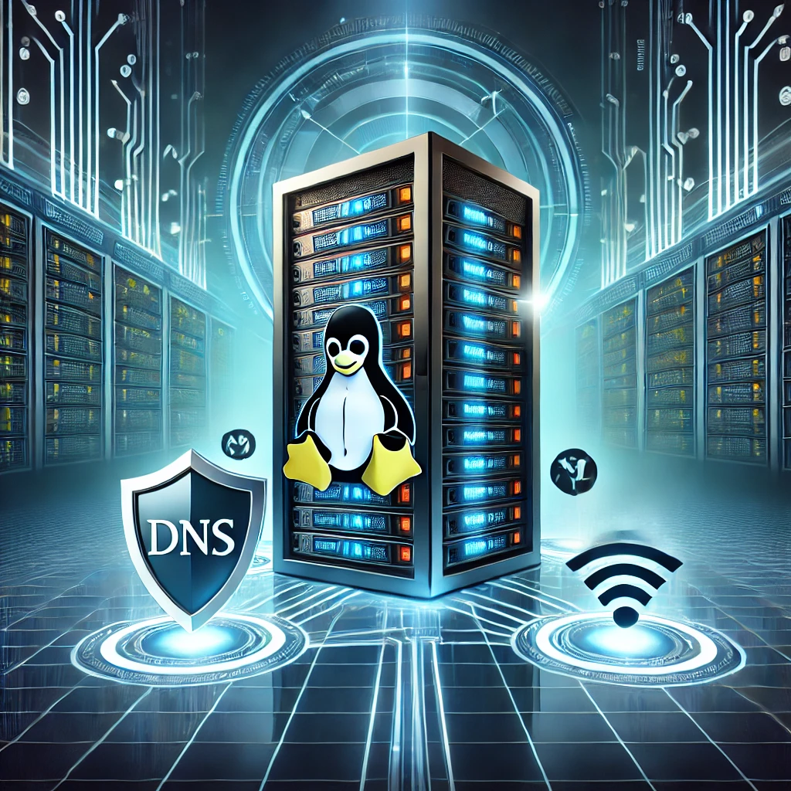

# README - Instalação, Uso e Manutenção do BIND no Debian 12

  
O BIND (Berkeley Internet Name Domain) é um dos servidores DNS mais populares e amplamente utilizados. Este guia cobre a instalação, configuração básica, uso e manutenção do BIND no Debian 12.

---

## 1. Instalação do BIND

### Passo 1: Atualizar o sistema
Antes de instalar o BIND, é recomendável atualizar os pacotes do sistema:
```bash
sudo apt update && sudo apt upgrade -y
```

### Passo 2: Instalar o BIND9
Para instalar o BIND9, execute:
```bash
sudo apt install bind9 bind9-utils bind9-doc -y
```

---

## 2. Configuração Básica

### Passo 1: Configurar o arquivo named.conf.options
Edite o arquivo `/etc/bind/named.conf.options` e ajuste conforme necessário:
```bash
sudo nano /etc/bind/named.conf.options
```
Exemplo de configuração:
```bash
options {
    directory "/var/cache/bind";
    recursion yes;
    allow-recursion { trusted_networks; };
    listen-on { any; };
    listen-on-v6 { any; };
    dnssec-validation auto;
    forwarders {
        8.8.8.8;
        8.8.4.4;
    };
};
```

Adicione sua rede confiável no bloco `allow-recursion`.

### Passo 2: Criar um arquivo de zona (se necessário)
Se você deseja configurar um servidor DNS autoritativo, crie um arquivo de zona em `/etc/bind/zones/db.exemplo.com`:
```bash
$TTL    604800
@       IN      SOA     ns1.exemplo.com. admin.exemplo.com. (
                        2024021901 ; Serial
                        604800     ; Refresh
                        86400      ; Retry
                        2419200    ; Expire
                        604800 )   ; Negative Cache TTL
;
@       IN      NS      ns1.exemplo.com.
ns1     IN      A       192.168.1.1
www     IN      A       192.168.1.2
```

Em seguida, configure essa zona no arquivo `named.conf.local`:
```bash
sudo nano /etc/bind/named.conf.local
```
Adicione a zona:
```bash
zone "exemplo.com" {
    type master;
    file "/etc/bind/zones/db.exemplo.com";
};
```

### Passo 3: Reiniciar o BIND
Depois de configurar os arquivos, reinicie o BIND para aplicar as alterações:
```bash
sudo systemctl restart bind9
```
Verifique o status do serviço:
```bash
sudo systemctl status bind9
```

---

## 3. Uso e Testes

### Testar a resolução de nomes
Utilize os comandos abaixo para testar o funcionamento do BIND:
```bash
dig @localhost exemplo.com
dig @192.168.1.1 exemplo.com
nslookup exemplo.com 192.168.1.1
```
Se houver erros, verifique os logs com:
```bash
sudo journalctl -u bind9 --no-pager -n 50
```

---

## 4. Manutenção e Segurança

### Atualização do BIND
Para manter o BIND atualizado, execute periodicamente:
```bash
sudo apt update && sudo apt upgrade -y
```

### Monitoramento de Logs
Os logs do BIND são armazenados em `/var/log/syslog`. Para filtrar mensagens relacionadas ao BIND:
```bash
sudo grep named /var/log/syslog
```

### Reiniciar e Habilitar o BIND na Inicialização
```bash
sudo systemctl enable bind9
sudo systemctl restart bind9
```

---

## 5. Resolução de Problemas

- **Erro: "connection timed out; no servers could be reached"**
  - Verifique se o BIND está rodando: `sudo systemctl status bind9`
  - Certifique-se de que as portas 53 TCP e UDP estão abertas no firewall.

- **Erro de sintaxe na configuração**
  - Teste a configuração antes de reiniciar: `sudo named-checkconf`
  - Valide os arquivos de zona: `sudo named-checkzone exemplo.com /etc/bind/zones/db.exemplo.com`

---

## Conclusão
Este guia cobre a instalação, configuração básica, uso e manutenção do BIND no Debian 12. Para uma configuração mais avançada, consulte a documentação oficial do BIND e as boas práticas de segurança para servidores DNS.


