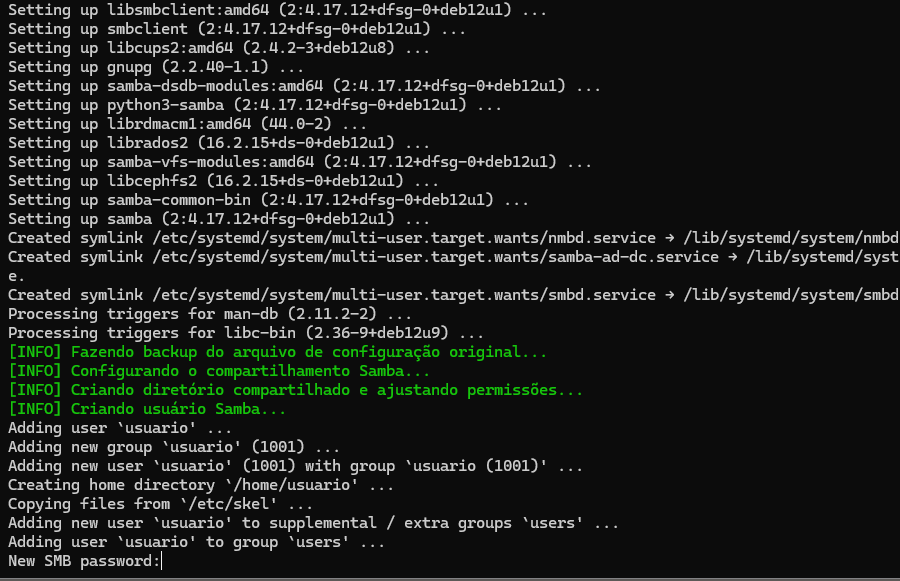
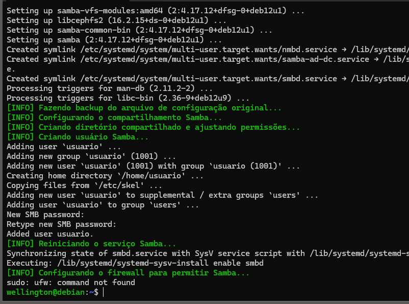
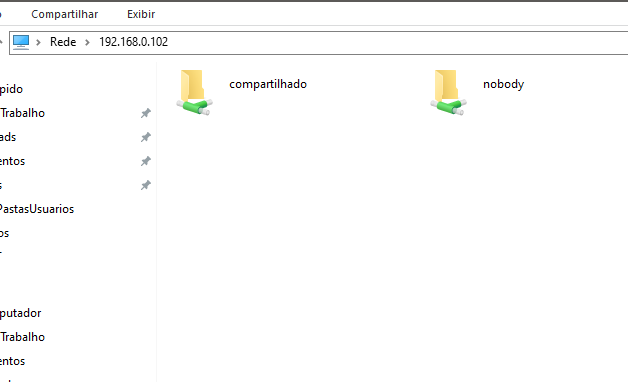
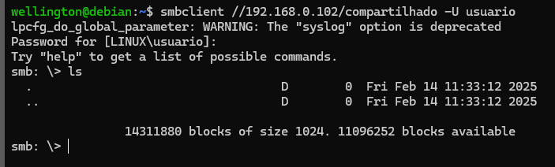
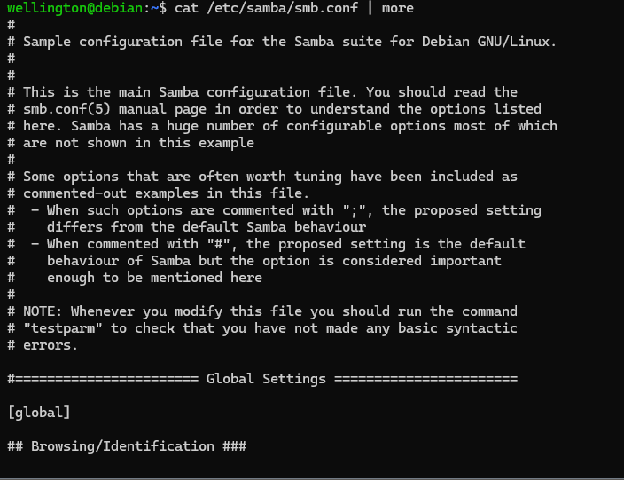
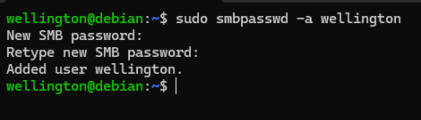
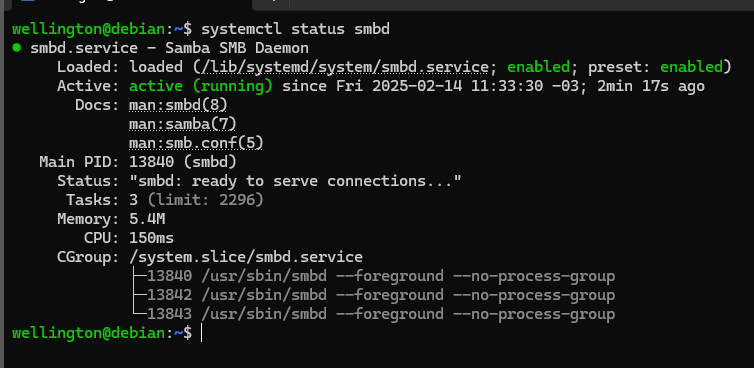
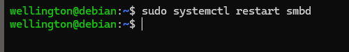

# Servidor de Arquivos (SAMBA) #


Este repositório contém um script automatizado para configurar um servidor de arquivos utilizando Samba no Debian 12. 
O script realiza todas as etapas necessárias para a instalação, configuração e ativação do compartilhamento de arquivos na rede.

## Automatizado:

Requisitos:  
-----------

- Debian 12 ou versão compatível  
- Usuário com privilégios de root ou acesso ao sudo
- Conexão com a internet para instalação dos pacotes  

Recursos do Script: 
-------------------

Atualiza o sistema operacional;  
Instala o Samba e configura um compartilhamento de rede;  
Cria um usuário Samba e define permissões;  
Configura o firewall para permitir conexões Samba;  
Reinicia e habilita o serviço Samba.  

Como Usar:
----------

1. Baixe o script para seu servidor e navegue até o diretório onde ele foi salvo: 
   ```
   cd servidor-samba
   ```

2. Torne o script executável: 
   ```
   chmod +x install-samba.sh
   ```

3. Execute o script com permissões de administrador:  
   ```
   sudo ./install-samba.sh
   ```
   
    
   
   
4. Acesse o compartilhamento de outro computador: 
   - No Windows, abra o Explorador de Arquivos e digite:
     ```
     \\<IP_DO_SERVIDOR>
     ```
     
     
   - No Linux, use o comando:  
     ```
     smbclient //<IP_DO_SERVIDOR>/compartilhado -U usuario
     ```
     


## Manualmente:

### 1. Pré-requisitos
Antes de executar este procedimento, certifique-se de que:
- O sistema operacional é uma distribuição Linux compatível (Debian, Ubuntu, CentOS, etc.).
- O usuário tem permissões administrativas (sudo).
- O servidor possui conectividade com a rede.

### 2. Etapas da Configuração
O processo de configuração do servidor de arquivos envolve os seguintes passos:
1. **Atualização do sistema**
2. **Instalação do Samba e dependências**
3. **Criação dos diretórios compartilhados**
4. **Configuração do smb.conf**
5. **Configuração de permissões de usuário e grupo**
6. **Integração com o Active Directory (opcional)**
7. **Reinício dos serviços e testes**

### 3. Instalação e Configuração
#### 3.1 Atualize o sistema
```bash
sudo apt update && sudo apt upgrade -y
```

#### 3.2 Instale o Samba e os pacotes necessários
```bash
sudo apt install samba winbind libnss-winbind libpam-winbind smbclient -y
```

#### 3.3 Configure o Samba
#### 3.3.1 Faça um backup do arquivo de configuração original
```bash
sudo cp /etc/samba/smb.conf /etc/samba/smb.conf.old
```

##### 3.3.2 Edite o arquivo de configuração do Samba
```bash
sudo nano /etc/samba/smb.conf
```

##### 3.3.3 Exemplo de configuração para um compartilhamento comum (Standalone):
```ini
[global]
workgroup = Linux
log file = /var/log/samba/log.%m
syslog = 0
server role = standalone server
map to guest = bad user

[compartilhado]
path = /srv/compartilhado
available = yes
browseable = yes
writable = yes
guest ok = yes
```

##### 3.3.4 Executar o testparm
```bash
sudo testparm
```

##### 3.3.5 Criar o diretório compartilhado
```bash
sudo mkdir -p /srv/compartilhado
sudo chmod -R 775 /srv/compartilhado
sudo chown -R nobody:nogroup /srv/compartilhado
```

##### 3.3.6 Exemplo de configuração para um compartilhamento com AD (Member Server):
```ini
[global]
# Domínio exemplo.com.br
workgroup = EXEMPLO
log file = /var/log/samba/log.%m
syslog = 0
server role = standalone server
map to guest = bad user
security = ADS
realm = EXEMPLO.COM.BR
netbios name = FILESERVER
server role = member server
idmap config * : backend = tdb
idmap config * : range = 10000-20000
winbind use default domain = yes
winbind offline logon = yes
winbind enum users = yes
winbind enum groups = yes
template shell = /bin/bash

[vendas]
path = /srv/vendas
browseable = yes
writable = yes
create mask = 660
directory mask = 770

# Escolha um (usuário ou grupo) e comente o outro.
# Por usuário (Dever ser criado no servidor. Consultar a seção "5. Adicionar um usuário ao Samba" para mais detalhes)
valid users = usuario

# Por grupos: Para deixar com mais grupos, uma opção é colocar vários grupos, um ao lado do outro.
# Ex.: valid users = @expemplo\grupo_vendas @expemplo\grupo_financeiro @expemplo\grupo_ti 
valid users = @expemplo\grupo_vendas 
```

Salve e feche o arquivo (`CTRL + X`, `Y`, `Enter`).


##### 3.3.7 Executar o testparm
```bash
sudo testparm
```

#### 3.4 Alterar o grupo do diretório compartilhado
```bash
sudo chown root:"EXEMPLO\grupo_vendas" /srv/vendas
sudo chmod -R 770 /srv/vendas
```

#### 3.4.1 Alterar o grupo do diretório compartilhado (Para vários grupos)
```bash
sudo chown root:"EXEMPLO\grupo_vendas" /srv/vendas
sudo chown root:"EXEMPLO\grupo_financeiro" /srv/vendas
sudo chown root:"EXEMPLO\grupo_ti" /srv/vendas
sudo chmod 770 /srv/vendas
```

### 4. Unir o Servidor ao Domínio (Opcional)
#### 4.1 Configure o DNS
```bash
sudo nano /etc/resolv.conf
```
Adicione:
```bash
nameserver IP_DO_AD
search SEU_DOMINIO.COM.BR
```

#### 4.2 Reinicie os serviços
```bash
sudo systemctl restart smbd nmbd winbind
```

#### 4.3 Ingresso no domínio
```bash
sudo net ads join -U Administrador
```

Teste o ingresso:
```bash
wbinfo -u  # Lista usuários do AD
wbinfo -g  # Lista grupos do AD
```

### 5. Adicionar um usuário ao Samba
#### 5.1 Criar um usuário no sistema
```bash
sudo adduser usuario
```

#### 5.2 Configurar uma senha para o usuário
```bash
sudo smbpasswd -a usuario
```

### 6. Reiniciar o Samba
```bash
sudo systemctl restart smbd
```

### 7. Configurar o Firewall (Opcional)
Se estiver usando um firewall, permita o tráfego do Samba:
```bash
sudo ufw allow samba
```

### 8. Teste o compartilhamento
#### No Windows
- Abra o Explorador de Arquivos.
- Digite `\\endereco_ip_do_servidor` na barra de endereços e pressione Enter.
- Insira o nome de usuário e senha do Samba quando solicitado.

#### No Linux
```bash
smbclient //endereco_ip_do_servidor/compartilhado -U usuario
```

### 9. Configurações adicionais (Opcional)
Se necessário, edite o arquivo `/etc/samba/smb.conf` para compartilhar impressoras ou ajustar permissões específicas.

    
Manutenção e Personalização: 
----------------------------

- O arquivo de configuração do Samba está localizado em:  
  ```
  /etc/samba/smb.conf
  ```
  
  
- Para adicionar novos usuários Samba:  
  ```
  sudo smbpasswd -a nome_usuario
  ```
  
  
- Para verificar o status do serviço Samba:  
  ```
  sudo systemctl status smbd
  ```  
  
  
- Para reiniciar o serviço após alterações:  
  ```
  sudo systemctl restart smbd
  ```

  
  
- Para colocar uma lixeira, na diretiva "[global]", insira:  
  OBS: O diretório "lixeira" deve ser criado no servidor.
  
   ```
   vfs object = recycle
   recycle:repository = /lixeira/%U
   recycle:directory_mode = 770
   recycle:keeptree = yes
   recycle:version = yes
   recycle:exclude = *.,p4, *.exe, *.msi, *.bat, *.log
   ```
   
- Para barrar alguns tipos de arquivos, na diretiva desejada, insira:  
  OBS: Pode-se usar o nome completo do arquivos, mas pode usar curingas.
   ```
   veto files = /*.mp3/*.mp4
   ```
   
### 10. Instalação da interface gráfica web: Webmin (Opcional)

#### 10.1 Baixar o script de instalação
```
curl -o webmin-setup-repo.sh https://raw.githubusercontent.com/webmin/webmin/master/webmin-setup-repo.sh
```

#### 10.2 Dar permissão de execução ao script
```
chmod +x webmin-setup-repo.sh
```

#### 10.3 Executar o script
```
sudo ./webmin-setup-repo.sh
```

#### 10.4 Instalar o webmin
```
sudo apt install webmin --install-recommends
```

#### 10.5 Acessar o servidor pelo webmin:
```
https://<IP-do-Servidor-de-arquivos>:10000
```


### Conclusão
Agora você tem um servidor de arquivos básico configurado usando o Samba no Debian 12. Personalize conforme suas necessidades!


Referências:
-----------

- [Documentação Oficial do Samba](https://www.samba.org/samba/docs/)  
- [Guia de Administração do Debian](https://wiki.debian.org/SambaServerSimple)
- [Webmin](https://webmin.com/download/)


