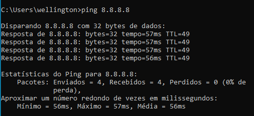
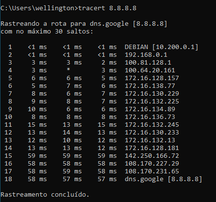

# Compartilhando a Internet no Debian 12

Este guia descreve como configurar o compartilhamento de Internet no Debian 12, utilizando `iptables` 
e o serviço DHCP para distribuir endereços IP a clientes conectados.

## 1. Configuração da Interface de Rede

### Identificando as Interfaces
Antes de começar, identifique suas interfaces de rede com o comando:
```sh
ip a
```
- Interface conectada à Internet: `enp0s3` (exemplo)
- Interface que compartilhará a conexão: `enp0s8` (exemplo)

### Configurando a Interface de Rede Interna
Edite o arquivo de configuração de rede:
```sh
sudo nano /etc/network/interfaces
```
Adicione as seguintes linhas para configurar um IP estático:
```ini
# Interface DHCP
auto enp0s8
iface enp0s8 inet static
address 10.200.0.1
netmask 255.0.0.0
network 10.0.0.0
broadcast 10.255.255.255
```
Reinicie a interface:
```sh
sudo systemctl restart networking
```

## 2. Instalar o iptable (Caso não esteja instalado)
Instale o iptable
```sh
sudo apt update && sudo apt install iptables -y
```

## 3. Habilitando o Roteamento
Ative o roteamento de pacotes:
```sh
sudo modprobe iptable_nat 
sudo echo 1 | sudo tee /proc/sys/net/ipv4/ip_forward
```
Para tornar a mudança permanente, edite o arquivo:
```sh
sudo nano /etc/sysctl.conf
```
Descomente ou adicione a linha:
```ini
net.ipv4.ip_forward=1
```
Aplicar as mudanças:
```sh
sudo sysctl -p
```

## 4. Configurando o NAT com iptables
Configure o NAT para permitir o tráfego:
```sh
sudo iptables -t nat -A POSTROUTING -o enp0s3 -j MASQUERADE
sudo iptables -A FORWARD -i enp0s8 -o enp0s3 -j ACCEPT
sudo iptables -A FORWARD -i enp0s3 -o enp0s8 -m state --state RELATED,ESTABLISHED -j ACCEPT
```
Para salvar as regras:
```sh
sudo iptables-save | sudo tee /etc/iptables.rules
```
Adicione ao `/etc/network/interfaces` para restaurar no boot:
```ini
post-up iptables-restore < /etc/iptables.rules
```

## 5. Testando a Conexão
Conecte um cliente à interface `enp0s8` e verifique se ele recebe um IP via DHCP. Teste o acesso à Internet.

## 6. Solução de Problemas
- Verifique logs do DHCP: `sudo journalctl -xe -u isc-dhcp-server`
- Confirme as regras do iptables: `sudo iptables -L -t nat`
- Teste a conectividade: a partir do cliente  
`ping 8.8.8.8` 
  
`tracert`  
 


