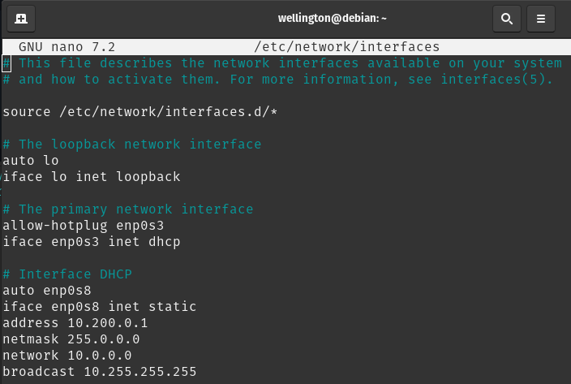

# Servidor DHCP no Debian 12  
Este guia descreve como instalar e configurar um servidor DHCP no Debian 12.  
  


## Requisitos
Antes de começar, certifique-se de:
- Ter acesso root ou um usuário com privilégios de sudo.
- Ter uma interface de rede configurada corretamente.

## Instalação do Servidor DHCP
1. Atualize o sistema:
   ```bash
   sudo apt update && sudo apt upgrade -y
   ```

2. Instale o servidor DHCP:
   ```bash
   sudo apt install isc-dhcp-server -y
   ```

## Configuração do Servidor DHCP
### 1. Definir a Interface de Rede
Edite o arquivo `/etc/default/isc-dhcp-server` e defina a interface de rede:
   ```bash
   sudo nano /etc/default/isc-dhcp-server
   ```
   Altere a linha `INTERFACESv4` para a interface desejada, por exemplo:
   ```bash
   INTERFACESv4="enp0s8"
   ```

### 2. Criar um backup do arquivo dhcpd.conf
Crie uma cópia do arquivo de configuração principal:
   ```bash
   sudo mv /etc/dhcp/dhcpd.conf /etc/dhcp/dhcpd.conf.old
   ```

### 3. Criar um novo arquivo dhcpd.conf
Crie o arquivo de configuração principal:
   ```bash
   sudo nano /etc/dhcp/dhcpd.conf
   ```

### 4. Configurar a segunda interface
Edite o arquivo de configuração de interfaces:
   ```bash
   sudo nano /etc/network/interfaces
   ```
   Adicione ou modifique as seguintes configurações:
   ```bash
   # Interface DHCP
   auto enp0s8
   iface enp0s8 inet static
   address 10.200.0.1
   netmask 255.255.255.0
   network 10.200.0.0
   broadcast 10.200.0.255
   ```
     
   
### 5. Configurar o Escopo de IPs
Edite o arquivo de configuração principal:
   ```bash
   sudo nano /etc/dhcp/dhcpd.conf
   ```
   Adicione ou modifique as seguintes configurações:
   ```bash
   ddns-update-style none;
   option domain-name " ";
   option domain-name-servers 8.8.8.8, 8.8.4.4;
   default-lease-time 600;
   max-lease-time 7200;
   authoritative;
       
   subnet 10.200.0.0 netmask 255.0.0.0 {
       range 10.200.0.100 10.200.0.200;
       option routers 10.200.0.1;
       option broadcast-address 10.255.255.255;      
   }
   ```
### 6. Fixar IP
Acrescente no final do arquivo de configuração o nome do host e seu MAC:
   ```bash
   sudo nano /etc/dhcp/dhcpd.conf
   ```
   ```
   host windows10 {
      hardware ethernet 08:00:27:D3:D4:F0;
      fixed-address 10.200.0.150;
   }
   ```
    
   
    
   
### 7. Reiniciar e Habilitar o Serviço
Após configurar, reinicie o serviço DHCP:
   ```bash
   sudo systemctl restart isc-dhcp-server
   ```
   Para garantir que o serviço seja iniciado automaticamente com o sistema:
   ```bash
   sudo systemctl enable isc-dhcp-server
   ```

## Verificando o Status
Para verificar se o servidor está rodando corretamente, execute:
   ```bash
   sudo systemctl status isc-dhcp-server
   ```

Para visualizar os leases ativos:
   ```bash
   cat /var/lib/dhcp/dhcpd.leases
   ```

## Solução de Problemas
- Se o serviço não iniciar, verifique os logs:
  ```bash
  sudo journalctl -xe | grep dhcp
  ```
- Certifique-se de que não há outro serviço DHCP rodando na rede.
- Verifique se a interface de rede configurada está correta.

## Referências
- [Documentação oficial do ISC DHCP Server](https://manpages.debian.org/buster/isc-dhcp-server/dhcpd.conf.5.en.html)


