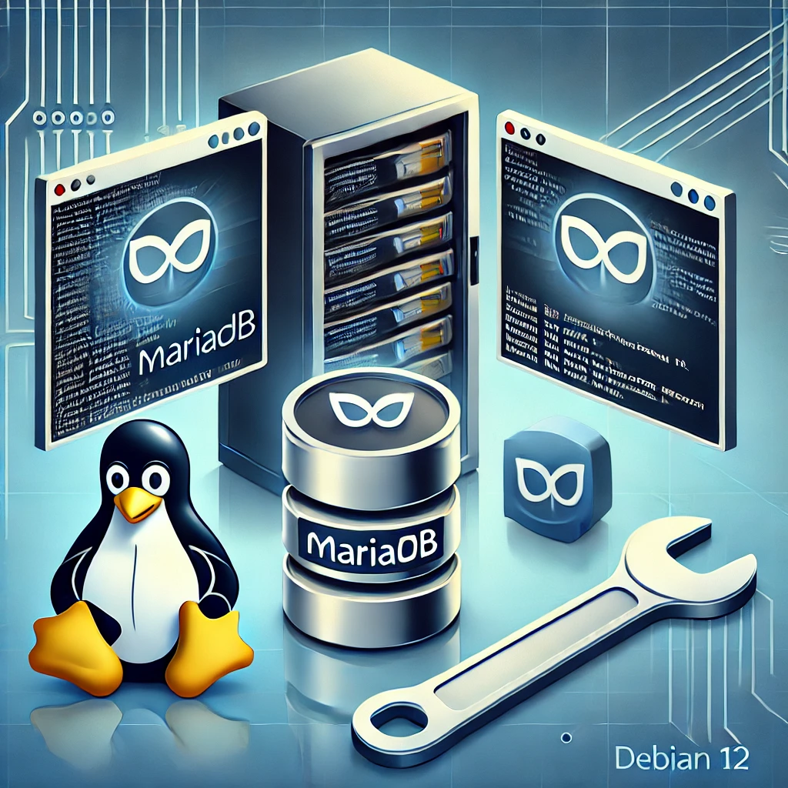

# Instalação e Manutenção do MariaDB no Debian 12
 

## Introdução
MariaDB é um sistema de gerenciamento de banco de dados relacional (SGBD) de código aberto e um fork do MySQL. Este guia explica como instalar, configurar e manter o MariaDB no Debian 12.

## Instalação do MariaDB

### Atualizar o Sistema
Antes de instalar, é recomendável atualizar os pacotes do sistema:
```bash
sudo apt update && sudo apt upgrade -y
```

### Instalar o MariaDB
Para instalar o MariaDB, execute o seguinte comando:
```bash
sudo apt install mariadb-server -y
```

### Verificar o Status do Serviço
Após a instalação, verifique se o MariaDB está rodando:
```bash
sudo systemctl status mariadb
```
Se não estiver ativo, inicie com:
```bash
sudo systemctl start mariadb
```
E habilite a inicialização automática no boot:
```bash
sudo systemctl enable mariadb
```

### Configurar a Segurança do MariaDB
Execute o script de segurança para configurar senhas e remover acessos inseguros:
```bash
sudo mysql_secure_installation
```
Siga as instruções na tela para:
- Definir uma senha para o root
- Remover usuários anônimos
- Desabilitar acesso remoto para o root
- Remover o banco de testes

## Configuração Básica

### Acessar o MySQL CLI
Para acessar o MariaDB como root:
```bash
sudo mysql -u root -p
```

### Criar um Novo Usuário e Banco de Dados
```sql
CREATE DATABASE meu_banco;
CREATE USER 'meu_usuario'@'localhost' IDENTIFIED BY 'minha_senha';
GRANT ALL PRIVILEGES ON meu_banco.* TO 'meu_usuario'@'localhost';
FLUSH PRIVILEGES;
EXIT;
```
## Uso básico do Banco de Dados

### 1. Criar um banco
```bash
CREATE DATABASE cadastro;
```

### 2. Listar os bancos existentes
```bash
SHOW DATABASES;
```

### 3. Selecionar o banco
```bash
USE cadastro;
```

### 4. Criar uma Tabela
```bash
CREATE TABLE usuarios (
    id INT AUTO_INCREMENT PRIMARY KEY,
    nome VARCHAR(100) NOT NULL,
    email VARCHAR(100) UNIQUE NOT NULL,
    idade INT NOT NULL
);
```

### 5. Listar as tabelas existentes
```bash
SHOW TABLES;
```

### 6. Inserir Dados
```bash
INSERT INTO usuarios (nome, email, idade) VALUES
    ('Alice Silva', 'alice@email.com', 25),
    ('Bruno Santos', 'bruno@email.com', 30),
    ('Carla Souza', 'carla@email.com', 28);
```

### 7. Exibir os dados da tabela
```bash
SELECT * FROM usuarios;
```

### 8. Atualizar registro da tabela
```bash
UPDATE usuarios SET idade = 29 WHERE nome = 'Carla Souza';
```

### 9. Deletar registro da tabela
```bash
DELETE FROM usuarios WHERE nome = 'Bruno Santos';
```

## Manutenção e Monitoramento

### Atualizar o MariaDB
Para manter o MariaDB atualizado, execute:
```bash
sudo apt update && sudo apt upgrade -y
```

### Reiniciar o Serviço
Se precisar reiniciar o MariaDB:
```bash
sudo systemctl restart mariadb
```

### Fazer Backup do Banco de Dados
Para criar um backup:
```bash
mysqldump -u root -p meu_banco > backup.sql
```
Para restaurar um backup:
```bash
mysql -u root -p meu_banco < backup.sql
```

### Monitorar o Desempenho
Verifique logs e status:
```bash
sudo journalctl -u mariadb --since "1 hour ago"
sudo mysqladmin -u root -p status
```

## Remover o MariaDB
Se precisar remover o MariaDB:
```bash
sudo apt remove --purge mariadb-server mariadb-client -y
sudo apt autoremove -y
sudo rm -rf /var/lib/mysql /etc/mysql
```

## Conclusão
Este guia fornece os passos essenciais para instalar, configurar e manter o MariaDB no Debian 12. Certifique-se de manter backups regulares e monitorar o desempenho para garantir um funcionamento estável.


