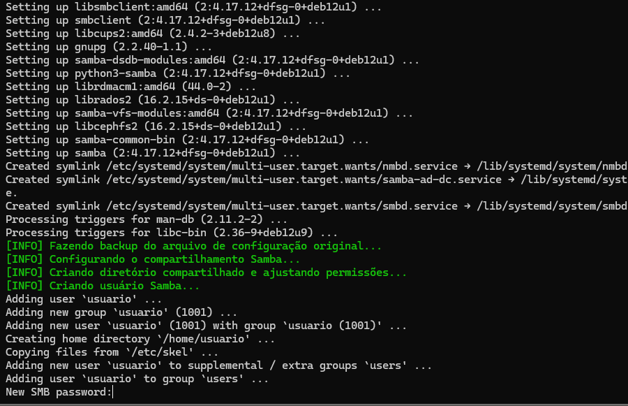
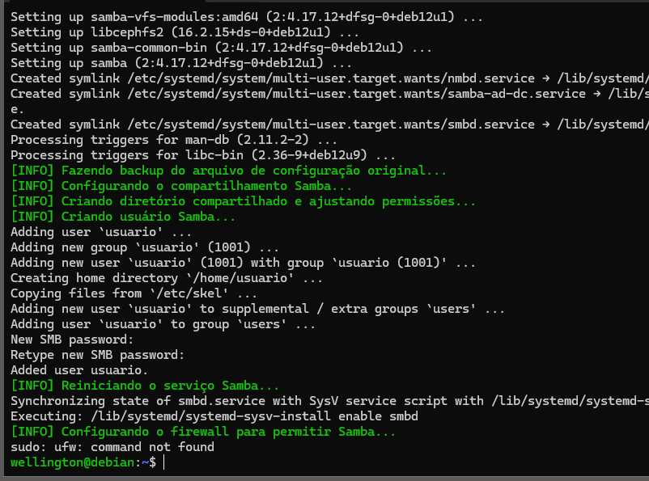
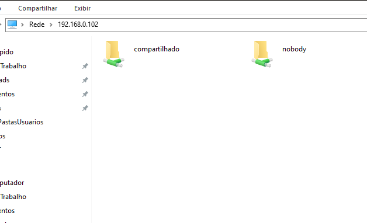
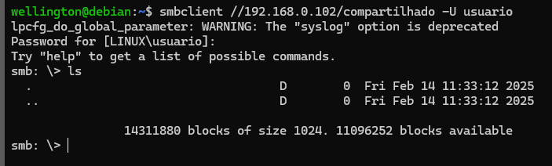
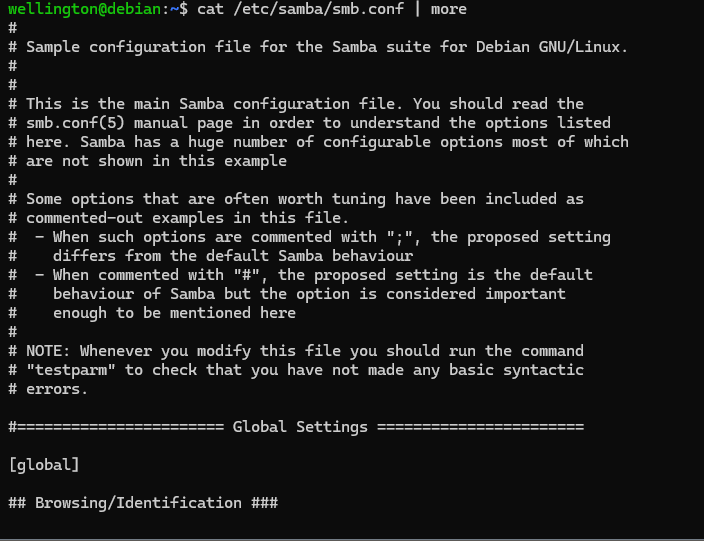
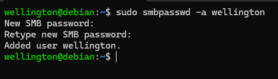
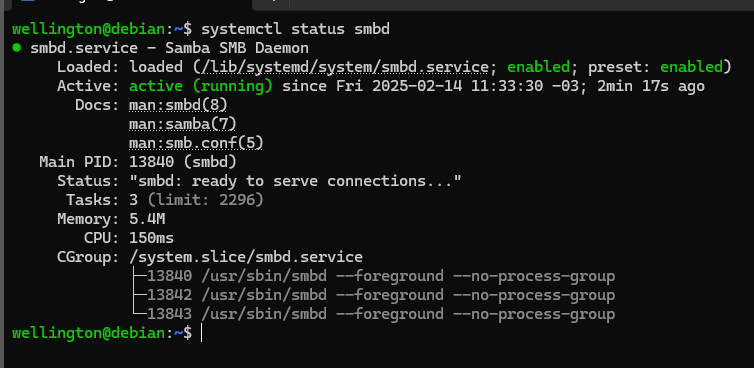
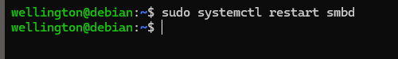

# Servidor de Arquivos (SAMBA) #


Este repositório contém um script automatizado para configurar um servidor de arquivos utilizando Samba no Debian 12. 
O script realiza todas as etapas necessárias para a instalação, configuração e ativação do compartilhamento de arquivos na rede.

Requisitos:  
-----------

- Debian 12 ou versão compatível  
- Usuário com privilégios de root ou acesso ao sudo
- Conexão com a internet para instalação dos pacotes  

Recursos do Script: 
-------------------

Atualiza o sistema operacional;  
Instala o Samba e configura um compartilhamento de rede;  
Cria um usuário Samba e define permissões;  
Configura o firewall para permitir conexões Samba;  
Reinicia e habilita o serviço Samba.  

Como Usar:
----------

1. Baixe o script para seu servidor e navegue até o diretório onde ele foi salvo: 
   ```
   cd servidor-samba
   ```

2. Torne o script executável: 
   ```
   chmod +x install-samba.sh
   ```

3. Execute o script com permissões de administrador:  
   ```
   sudo ./install-samba.sh
   ```
   
    
   
   
4. Acesse o compartilhamento de outro computador: 
   - No Windows, abra o Explorador de Arquivos e digite:
     ```
     \\<IP_DO_SERVIDOR>
     ```
     
     
   - No Linux, use o comando:  
     ```
     smbclient //<IP_DO_SERVIDOR>/compartilhado -U usuario
     ```
     
     
Manutenção e Personalização: 
----------------------------

- O arquivo de configuração do Samba está localizado em:  
  ```
  /etc/samba/smb.conf
  ```
  
  
- Para adicionar novos usuários Samba:  
  ```
  sudo smbpasswd -a nome_usuario
  ```
  
  
- Para verificar o status do serviço Samba:  
  ```
  sudo systemctl status smbd
  ```  
  
  
- Para reiniciar o serviço após alterações:  
  ```
  sudo systemctl restart smbd
  ```

  
  
- Para colocar uma lixeira, na diretiva "[global]", insira:  
  OBS: O diretório "lixeira" deve ser criado no servidor.
  

   ```
   vfs object = recycle
   recycle:repository = lixeira
   recycle:keeptree = yes
   recycle:version = yes
   recycle:repository = /lixeira
   ```
- Para barrar alguns tipos de arquivos, na diretiva desejada, insira:  
  OBS: Pode-se usar o nome completo do arquivos, mas pode usar curingas.
   ```
   veto files = /*.mp3/*.mp4
   ```

Referências:
-----------

- [Documentação Oficial do Samba](https://www.samba.org/samba/docs/)  
- [Guia de Administração do Debian](https://wiki.debian.org/SambaServerSimple)  


