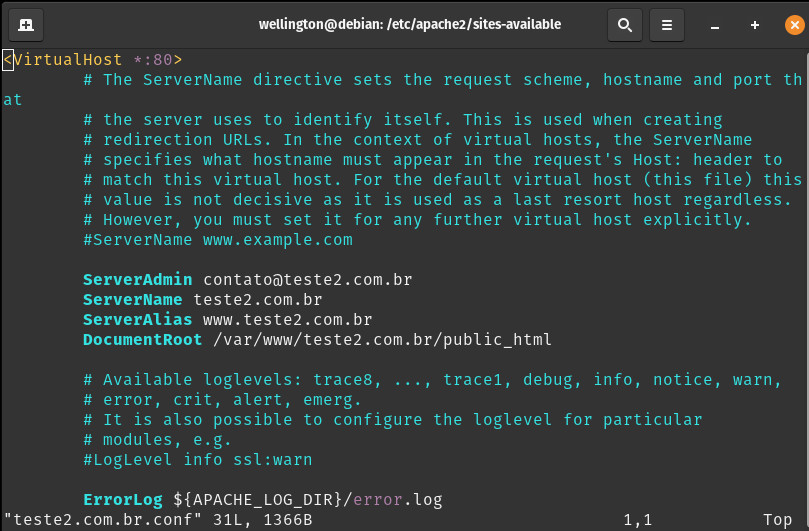
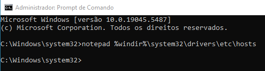
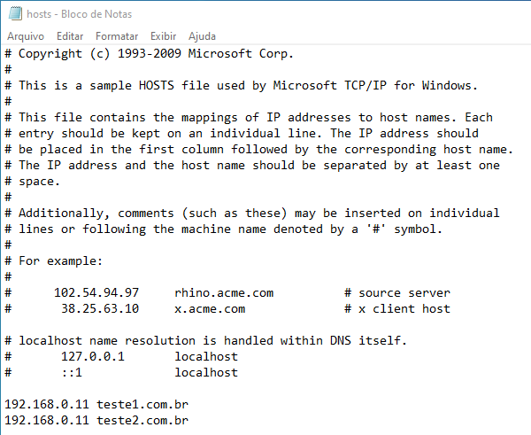
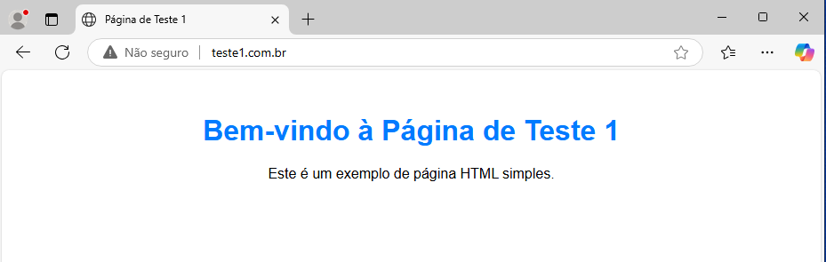
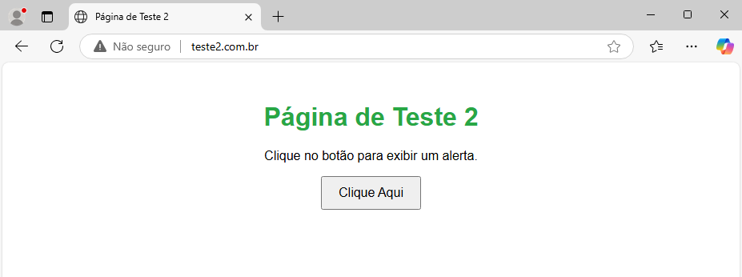

# Configurando um Servidor Web no Debian 12
Este guia descreve como instalar e configurar um servidor web no Debian 12 usando o Apache.
  
## Requisitos
Antes de começar, certifique-se de:
- Ter acesso root ou um usuário com privilégios de sudo.
- Ter uma conexão ativa com a internet.

## Instalação do Servidor Web
1. Atualize o sistema:
   ```bash
   sudo apt update && sudo apt upgrade -y
   ```

2. Instale o Apache:
   ```bash
   sudo apt install apache2 -y
   ```

## Configuração do Servidor Web
### 1. Verificar o Status do Serviço
Após a instalação, verifique se o serviço está rodando:
   ```bash
   sudo systemctl status apache2
   ```
   Para garantir que o serviço seja iniciado automaticamente com o sistema:
   ```bash
   sudo systemctl enable apache2
   ```

### 2. Configurar Firewall
Se estiver usando o UFW, permita o tráfego HTTP e HTTPS:
   ```bash
   sudo ufw allow 'Apache Full'
   sudo ufw enable
   ```

### 3. Testar a Instalação
Abra um navegador e digite o endereço do servidor:
   ```
   http://seu_ip_servidor
   ```
   Você deve ver a página padrão do Apache.

## Configuração Avançada
- Hospedar um site personalizado (Aqui, serão 2 como exemplos):  

  ### 1. Crie os diretórios para ambos os sites
  ```bash
  sudo mkdir -p /var/www/teste1.com.br/public_html
  sudo mkdir -p /var/www/teste2.com.br/public_html
  ```
   
  ### 2. Crie o index.html para os sites  
  #### 2.1 `teste1.com.br`
  ```bash
  echo '<!DOCTYPE html>
  <html lang="pt-BR">
  <head>
    <meta charset="UTF-8">
    <meta name="viewport" content="width=device-width, initial-scale=1.0">
    <title>Página de Teste 1</title>
    <style>
       body { font-family: Arial, sans-serif; text-align: center; margin: 50px; }
       h1 { color: #007bff; }
    </style>
  </head>
  <body>
     <h1>Bem-vindo à Página de Teste 1</h1>
     <p>Este é um exemplo de página HTML simples.</p>
  </body>
  </html>' > /var/www/teste1.com.br/public_html/index.html
  ```
  
  #### 2.2 `teste2.com.br`
  ```bash
  echo '<!DOCTYPE html>
  <html lang="pt-BR">
  <head>
     <meta charset="UTF-8">
     <meta name="viewport" content="width=device-width, initial-scale=1.0">
     <title>Página de Teste 2</title>
     <style>
        body { font-family: Arial, sans-serif; text-align: center; margin: 50px; }
        h1 { color: #28a745; }
           button { padding: 10px 20px; font-size: 16px; cursor: pointer; }
     </style>
  </head>
  <body>
     <h1>Página de Teste 2</h1>
     <p>Clique no botão para exibir um alerta.</p>
     <button onclick="mostrarMensagem()">Clique Aqui</button>
      <script>
        function mostrarMensagem() {
           alert("Olá! Você clicou no botão.");
        }
     </script>
  </body>
  </html> ' > /var/www/teste2.com.br/public_html/index.html
  ```
  
  ### 4. Faça o backup do arquivo de configuração do Virtual Host
  ```bash
  sudo cp /etc/apache2/sites-available/000-default.conf /etc/apache2/sites-available/000-default.conf.old
  ```

  ### 5. Usando o arquivo `000-default.conf` como base, crie um arquivo de configuração do Virtual Host para o site `teste1.com.br` e um para o `teste2.com.br`
  ```bash
  sudo cp /etc/apache2/sites-available/000-default.conf /etc/apache2/sites-available/teste1.com.br.conf
  sudo cp /etc/apache2/sites-available/000-default.conf /etc/apache2/sites-available/teste2.com.br.conf
  ```
   
  ### 6. Modifique o arquivo e acrescente as seguintes linhas:  
  #### 6.1 Para o site `teste1.com.br`
  ```bash
  ServerAdmin contato@teste1.com.br
  ServerName teste1.com.br
  ServerAlias www.teste1.com.br
  DocumentRoot /var/www/teste1.com.br/public_html
  ```  
  
   
  #### 6.2 Para o site `teste2.com.br`
  ```bash
  ServerAdmin contato@teste2.com.br
  ServerName teste2.com.br
  ServerAlias www.teste2.com.br
  DocumentRoot /var/www/teste2.com.br/public_html
  ```
  
   
  ### 7. Desative o site padrão `000-default.conf`
  ```bash
  sudo a2dissite 000-default.conf
  ```
  
  ### 8. Ative os sites `teste1.com.br.conf` e `teste2.com.br.conf`
  ```bash
  sudo a2ensite teste1.com.br.conf
  sudo a2ensite teste2.com.br.conf
  ```
  
  ### 9. Reinicie o Apache:
  ```bash
  sudo systemctl restart apache2
  ```
   
  ### 10. Em uma máquina cliente (Por exemplo, windows), usando o cmd, altere o arquivo hosts
  ```bash
  notepad %windir%\system32\drivers\etc\hosts
  ```
  
  
  Acrescente as seguintes linas:
  ```bash
  IP_SERVIDOR teste1.com.br
  IP_SERVIDOR teste2.com.br
  ```
  
  
## Testes  
- Numa máquina cliente, acesse pelo navegador: 
  ```bash
  http:\\teste.1.com.br
  ```  
  
  
  ```bash
  http:\\teste.2.com.br
  ```
  
  
## Solução de Problemas
- Se o serviço não iniciar, verifique os logs:
  ```bash
  sudo journalctl -xe | grep apache2
  ```
- Certifique-se de que nenhuma outra aplicação está ocupando a porta 80.
- Verifique permissões e propriedade dos arquivos em `/var/www/html/`.

## Referências
- [Documentação oficial do Apache](https://httpd.apache.org/docs/2.4/)


